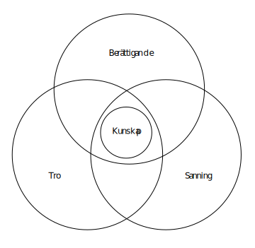

# Kunskap & Sanning

<!--Döp om till bara ”Kunskap”? Eller? Kanske inte om jag ska ha en del om kunskapens källa? -->

## Den klassiska definitionen av kunskap
**Kommentar:** Det finns olika former av kunskap. En form av kunskap är den vi har när vi kan cykla eller spela fotboll. Denna form av kunskap kallar vi färdigheter. En annan form av kunskap är den kunskap som berör hur saker och ting förhåller sig. Det är i första hand den senare formen som vi nu kommer att fokusera på (även om de till viss del givetvis går in i varandra).

Den klassiska definitionen av kunskap är _sann berättigad tro_. Med detta menas att något endast kan kallas kunskap om det uppfyller följande tre kriterier:

1. Jag tror att något är fallet
2. Jag har en tillräcklig anledning (goda skäl) att tro att detta något är fallet
3. Det jag tror är fallet är också fallet (det jag tror är sant). 

Det är inte möjligt att utan självmotsägelse påstå att jag vet något (har kunskap om det) om jag samtidigt inte tror på det. En mening så som "jag vet att solen skiner, men jag tror inte på det" är möjligen poetisk men inte logisk. Likaså måste det vi tror är sant också _vara sant_. Om jag tror att alla bollar i världen är röda varpå någon visar mig en grön boll och jag ändå fortsätter tro att alla bollar i världen är röda är jag möjligen färgblind, men jag har ingen vidare kunskap om bollars olika färger.  

Så långt har vi klargjort punkt ett och tre. Men punkt två då? Att vi måste ha en anledning att tro något handlar om att kunskap inte är en gissningslek. Att veta något, att ha verklig kunskap, handlar om att också förstå _varför_ man tror något. En person som på frågan "hur vet du det?" endast svarar "jag bara vet det" är inte en person vars "kunskap" man kanske tar på något större allvar (vår kunskap bör ha någon form av giltig källa). I detta kan olika "berättiganden" utgöra olika goda skäl. En person som säger "det kommer regna imorgon, jag känner det på mig" litar man förhoppningsvis mindre på än en meteorolog (även om meteorologer ofta har fel så är deras berättigande av en annan kvalité). 

**Kommentar:** Vad som mer exakt från fall till fall utgör goda skäl är dock en diskussionsfråga och inget som det finns ett enkelt svar på. 

Den klassiska definitionen av kunskap är inte okontroversiell och utan problem (den intresserade kan läsa om de så kallade gettierproblemen [här](http://www.iep.utm.edu/gettier/)), men det är likväl denna som vi allra oftast utgår ifrån, både till vardags och inom filosofin. Mer intressant för stunden (åtminstone i en grundkurs i filosofi) är framförallt de olika sätt som vi kan beskriva och analysera relationen mellan de olika delarna (sanning, tro, berättigande). Vi kommer nu gå igenom skepticistiska, relativistiska, objektivistiska och pragmatiska kunskapsuppfattningar.

## Skepticism
Om vi har ett skeptiskt förhållande till kunskap innebär det att vi avfärdar möjligheten till verkligt vetande och kunskap. Skepticismen menar att vår "kunskap" alltid bär på en oundviklig och total osäkerhet. Enligt skepticismen är det omöjligt att få någon form av bekräftelse på att det vi tror är rätt: inga skäl att tro något, hur goda de än tycks vara, är någonsin tillräckliga för att faktiskt _veta_ något. Vad som är sant och vad som är osant går helt enkelt inte att med säkerhet skilja på. I detta kan vi antingen vara skeptiker med avseende på alla kunskapsområden (global  skepticism) eller endast med avseende på vissa (lokal skepticism). 

> Ett exempel på en skeptiker är [David Hume](3_5_filosoferna.md#Hume). Om honom, och mer om hans variant av skeptisism, läser man [här](3_5_filosoferna.md#Hume).

<!-- i läroboken på sidorna 117-119.  -->

<!--Få in epistemologisk skepticism som exempel här? Men isf först göra distinktionen mellan metafysisk och epistemologisk skeptisism i verkligheten-delen? -->

## Relativism

En relativistisk ståndpunkt är den som hävdar att sanning alltid existerar i relation till ett tänkande subjekt och/eller i en viss kontext. 

Med detta menas: 

1. Några absoluta sanningar utanför och oberoende av subjektet (människan/medvetandet) existerar ej.
2. Ett påståendes sanningsvärde ges av individen (subjektivism) eller kulturen (kultur-relativism).
3. Det är omöjligt att (helt) skilja sanning från tro. 

**Ordförklaring:** Begreppet subjekt syftar till "det som upplever" (exempelvis en människa). Begreppen subjektiv och objektiv handlar om distinktionen mellan den inre och yttre verkligheten. En subjektiv uppfattning är *personlig* medan en objektiv uppfattning berör hur saker är _oberoende_ av vår egna *personliga* uppfattning (vilket relativismen menar är en omöjlig uppfattning). 

En mycket viktig distinktion här är den mellan den strikta epistemologiska relativismen och den högst okontroversiella uppfattningen att människor väldigt ofta har mycket olika åsikter om vad som är sant och falskt. Den första uppfattningen handlar om sanning, den andra endast om tro. Relativismen säger oss inte bara att vi *tycker* eller *tror* olika, den säger oss därtill att två människor, med *helt motsatta* åsikter eller föreställningar, kan göra *samma sanningsanspråk*. Med andra ord att den enes sanning *bokstavligen* är lika sann som den andres. Det kan alltså existera flera motstridiga sanningar som berör en och samma sak, men som alla är lika sanna. 

Till skillnad från en objektivistisk syn på kunskap och sanning finns det ingen sanning utanför oss som vi kan jämföra vår ”inre sanning” med. Om man på medeltiden trodde att jorden var platt var det också sant att jorden var platt. 

### Olika former av relativism

Relativismen kommer i många former. Det enklaste sättet att se de huvudsakliga skiljelinjerna mellan dessa är att ställa två frågor:

1. Vad är relativt?
2. Vad är detta relativt till?

Den första frågan rör vilken typ av kunskap/sanning som är relativ. Den andra frågan rör vad eller vem som skapar denna sanning/kunskap.

Vad gäller den första frågan står den vanligaste skiljelinjen mellan de som anser att *all* kunskap är relativ och de som anser att endast moralen är relativ. De första kallas **kunskapsrelativister** och de senare för **värderelativister**.  Man skulle förvisso kunna *tänka sig* en variant där man endast är kunskapsrelativist, men inte värderelativist, men detta är ganska ovanligt. Oftast är det moralen som faller för relativistiska synsätt först. Därför brukar kunskapsrelativism också *implicera* en värderelativism, men inte vice versa. 

Vad gäller den andra frågan står den vanligaste skiljelinjen mellan de som anser att kunskapen och/eller moralen är relativ till den *enskilda människan* och subjektet (subjektivism) och de som anser att kunskapen och/eller moralen är relativ till *kulturen* eller gruppen/samhället (kulturrelativism). De första menar att det som är sant för Pelle är lika sant som det som är sant för Lisa. De senare menar att det som är sant inom en viss kultur/grupp/samhälle är lika sant som det som är sant inom en viss annan kultur/grupp/samhälle. 

## Objektivism

**OBS:** Begreppet "Objektivism" ska här ej sammanblandas med Ayan Rands filosofi. Denna kommer ofta upp vid sökningar – vilket kan vara förvirrande. 

En objektivistisk syn på kunskap/sanning innebär att det finns något som är sant oberoende av våran subjektiva uppfattning och att två helt motstridiga påståenden inte samtidigt kan vara lika sanna. Kort och gott är ett påstående alltid sant _eller_ inte (det kan inte vara både och).

Inom objektivismen utgår man ifrån **korrespondensteorin** om sanning: en trosföreställning är endast sann om den _korresponderar_ med (svarar mot) en objektiv verklighet. Enkelt uttryckt är ett påstående sant endast om det överensstämmer med hur saker faktiskt förhåller sig. I detta spelar vad vi tror mindre roll, tro kan aldrig i sig självt skapa sanning. Till skillnad från relativismen är alltså tanken att vi någonstans kan jämföra vår subjektiva uppfattning med en objektiv verklighet och på så vis skilja mellan kunskap och ren tro. 

### Absolutism
Absolutismen är den mest rättframma av ”objektivismer” och i många sammanhang används också objektivism och absolutism synonymt. Enligt absolutismen finns det kort och gott objektiva sanningar som vi med säkerhet kan veta någonting om. 

Absolutismen är dock inte den enda formen av objektivism. För även om vi resonerar som så att en objektiv sanning förmodligen existerar, så kan vi likväl samtidigt resonera som så att det är mycket svårt, eller rent av omöjligt, att helt och fullt *nå insikt* om denna sanning. 

### Fallibilism
Enligt fallibilismen är verklig kunskap alltid objektivt sann, men huruvida vi själva besitter denna kan vi aldrig veta med säkerhet. Den mänskliga kunskapen är både osäker/felbar och temporär/provisorisk. Det finns inget som är fullständigt säkert, vi kan aldrig någonsin utesluta möjligheten att vi kan ha fel. 

<!--Få in koppling till korrespondensteori här? -->

Samtidigt ska vi inte frestas att inta en relativistisk ståndpunkt. All tro är varken lika berättigad eller lika sann. Och inte heller ska vi passiviseras av **skepticism**. Även om vi alltid bör förbli skeptiska, kan vi nå framsteg i vår kunskap. Fallibilismen ses ofta som en _form_ av skepticism, men skillnaden är att fallibilismen menar att saker kan vara mer eller mindre troliga än andra. En mer ren skepticism skulle inte tillåta ett sådant antagande, utan istället ifrågasätta eller rentav förneka möjligheten till kunskap överhuvudtaget.

<!--Få in något om skepticism här och hur fallibilism kan ses som en typ av skepticism, men att den ändå skiljer sig från den mer rena formen av skepticism. Kanske ska nedanstående med allt för tydlig koppling till falsifikationism tas bort eller så får kopplingen göras explicit -->

Vi kan mycket väl ha helt rätt i en viss fråga, men huruvida vi med säkerhet, kan veta detta är inte poängen (menar fallibilismen). Det viktiga är att vi har en ärlig och ödmjuk inställning till vår kunskap. Att vi vågar utsätta våra egna åsikter, föreställningar och hypoteser för kritik. Fallibilism hänger här ihop med [_falsifikationism_](3_4_vetenskapen.md#Falsifikationism): En hypotes (ett testbart antagande) som överlever är kanske inte alltid sann, detta kan vi strikt taget inte veta någonting om, men den är i vart fall *mer* säker än den som vi lyckats motbevisa.

> Ett exempel på en fallibilist är [Karl Popper](3_4_vetenskapen.md#Popper). Om honom, och mer om fallibilism och falsifikationism, läser man i avsnittet ["Vetenskapen"](3_4_vetenskapen.md#Popper).

## Pragmatism

En tredje väg, och ett alternativ till skiljelinjen mellan objektivism och relativism, är pragmatismen. Denna menar att objektiv och relativ ”sanning” båda är begrepp vilka vi bör ”lägga åt sidan”. 

<!--Tog bort ”metafysiska” framför ”begrepp”, krånglar kanske till det mer än det hjälper? -->

Istället menar pragmatikerna att vi bör använda ordet ”sant” för ”det som fungerar”. I detta likställs på ett sätt sanningen i vår kunskap med själva berättigandet då pragmatismen säger att all kunskap bör mätas utifrån dess nytta, användbarhet och förmåga att förutsäga händelseförlopp. På frågan "varför tror du det" svarar alltså pragmatikern: "för att det funkar".

All kunskap är för pragmatismen i grund och botten problemlösande och hur väl vår kunskap löser våra problem, såväl filosofiska och vetenskapliga som vardagliga, är det enda vi både _kan_ och _behöver_ veta. Sanning i någon mer metafysisk bemärkelse är för pragmatiker ett tämligen värdelöst begrepp. 

**Kommentar:** Detta innebär inte att en lögn blir sann bara för att den ”fungerar” i vilken mening som helst (exempelvis: någon tror på den). Lögnen ger oss inte en ”fungerande” bild av verkligheten, tvärtom inser vi att den är en lögn så snart vi också inser att den är mycket dålig på att vägleda oss i verkligheten och lösa våra problem (det ligger i lögnens natur – lögnen "löser" mest problem för den som uttalar den). 

## Kunskapen & verkligheten...

Som ni märker hänger frågan om kunskapen tätt samman med frågan om verkligen. Det är dock inte så enkelt att vi kan säga att alla idealister är relativister och att alla realister är objektivister. Exempelvis kan Kant sägas vara både relativist och objektivist beroende på tolkning. Likaså är Platon en klassisk objektivist även om han inte är realist. 

Det är av denna anledning de två frågorna ändå måste hållas isär. De berör på många sätt samma sak, men de behandlar olika aspekter. 

<!--Fylla på något här? -->

## [Frågeformulär]

<iframe src="https://docs.google.com/forms/d/1NRQFa5R2TsqpDSomT13W5KtSlrC26oG51-inGWLoRbA/viewform?embedded=true" width="100%" height="1300" frameborder="0" marginheight="0" marginwidth="0">Läser in...</iframe>