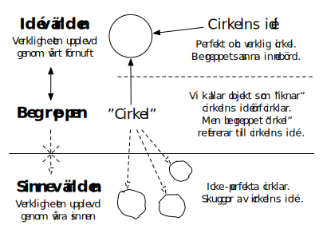
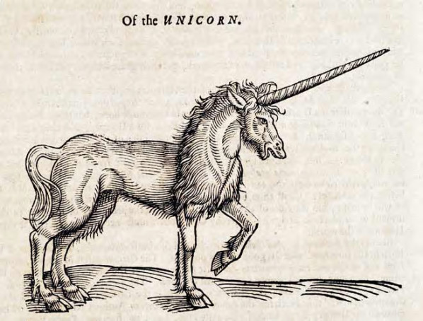
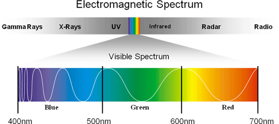
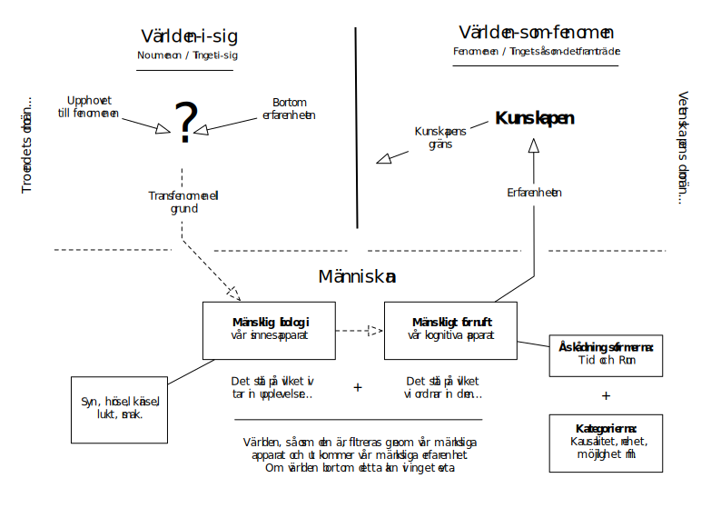

# Filosoferna

**Om denna sida:** Här kommer text om de filosofer vi behandlar under detta delmoment framöver att fyllas på. Förhoppningsvis blir detta arbete klart under VT17. I annat fall delar jag ut en kompletterande lärobok eller annat extramaterial.

## Platon
> **Kort om:** Platon (427-347 f.Kr.) är en av filosofihistoriens allra mest kända och betydelsefulla filosofer. Vissa har till och med sagt att all filosofi sedan Platon endast utgör små fotnoter till hans filosofi. 

<!--Filosofen Alfred North Whitehead menade till och med att den västerländska filosofins historia närmast kunde beskrivas som en serie fotnoter till Platon.  -->

<!-- Läs mer om Platon som person på [Wikipedia](https://sv.wikipedia.org/wiki/Platon) -->

Platons filosofi tillhör filosofihistoriens mer radikala [**objektiva idealism**](3_2_verkligheten.md#Idealism) och [**rationalism**](3_3_2_kunskapens_kalla.md#Rationalismen). För Platon finns det ingen  anledning att lita på våra sinnen och vår kunskap kan därför inte heller bygga på sinnlig erfarenhet. Tvärtom tänker sig Platon att det existerar en *högre verklighet* bortom den mer omedelbara sinnliga verkligheten. En högre verklighet som vi alla har möjlighet att skymta genom tankemässig ansträngning. 

I detta delar Platon upp "verkligheten" i två världar. Den ena världen kallar han för _sinnesvärlden_ och den andra _idévärlden_. Sinnesvärlden är världen så som vi möter den via våra sinnen (syn, hörsel, känsel, lukt, smak), idévärlden så som vi möter världen via vårt förnuft. 

Sinnesvärlden är egentligen inte mycket till verklighet, denna är endast skenbar (en illusion) och förgänglig (temporär). Ingenting vi "lär oss" i sinnesvärlden kan kallas för verklig kunskap. För Platon är nämligen sanning något evigt och oföränderligt (varaktigt) – verklig sanning är alltid _nödvändigt_ sann (av typen: det kan inte vara på något annat sätt). 

<!--(det kan inte vara på något annat sätt) -->

<!--Formulera om ovanstående mening (bygg om den syftningsmässigt och ordningsmässigt) --> 

Idévärlden är den sanna verkligheten bortom tid och rum. En  oföränderlig och _ideal_ verklighet där en fyrkant alltid är en perfekt fyrkant. Sinnesvärlden är endast en ofullkomlig kopia eller förvrängd avspegling av idévärlden. I sinnesvärlden är ett cirkelformat objekt aldrig helt cirkelformat och en rät linje aldrig helt rät. Vad det innebär att något är cirkelformat går därför inte att förstå genom att endast undersöka objekt som ser cirkelformade _ut_. Tvärtom förstår vi endast begreppet "cirkel" om vi vänder oss till vårt förnuft – genom att vi förstår "cirkelns idé". För Platon är kunskapen i slutändan en begreppskunskap och idévärlden är "platsen" där vi finner begreppens (idéernas) sanna innebörd. 

> _Så vad är en cirkel?_
> > 
> > En cirkel är "en plan sluten kurva vars alla punkter har samma avstånd till en given punkt, cirkelns centrum eller medelpunkt." (NE)

<!--Låt oss gå till nationalencyclopedin. _ -->

<!--linje (av latin liʹnea ’(rätte)snöre’, ’gräns(linje)’, egentligen ’linje’, ’streck’, av liʹnum ’lin’, ’garn’, ’tråd’, ’snöre’), i matematiken detsamma som kurva. Vanligtvis avses dock rät linje som i euklidisk geometri är den kortaste vägen mellan två punkter. -->

På samma sätt förhåller det sig även med mindre abstrakta ting (än sådant som cirklar och räta linjer). Stolar kan exempelvis se ut på väldigt olika sätt – men de är alla likväl stolar. Om vi frågar oss vad en stol _verkligen är_ frågar vi oss inte hur en viss specifik stol ser ut. Vi frågar oss vad som är _gemensamt_ för _alla_ stolar – vad _stolens idé_ är. Stolar kan av denna anledning också vara _olika bra på att vara stolar_. En stol som är svår att sitta på har en mindre del i stolens idé än  en stol som är bekväm. 

När vi ser en katt upplever vi inte bara den konkreta katten framför oss. Vi upplever också _att_ _det är_ en katt – vi skådar (åtminstone en del av) "kattens idé". En person som inte har en uppfattning om "kattens idé" ser bara "det där". Bara i den mån vi förstår att det vi ser har något gemensamt med något annat kan vi _kategorisera_ det vi ser och förstå att det har en del i samma idé. 

<!--Kanske utveckla det där med del i samma idé att två saker har något gemensamt HANDLAR om att de delar samma idé -->

<!--Försök förenkla och dela upp första meningen nedan -->

Om jag, som inte vet någonting om sporten curling, går på en curlingmatch, tillsammans med en kompis som förstår curlingens regler, har vi båda inte i samma mening sett matchen. Vad jag som inte kan curling ser är något helt annat än vad min kompis ser. För min kompis är matchen helt begriplig, men för mig helt obegriplig – och på samma sätt förhåller det sig med allt i världen. Vi kan inte förstå verkligheten om vi inte förstår begreppen/idéerna. Endast genom att förnutsmässigt förstå världens "orginalritning" kan vi nå kunskap – sinnesvärlden är endast en _skugga_ av idévärlden. 

I detta är Platon **begreppsrealist**. Cirkelns idé såväl som stolens idé existerar i idévärlden oberoende av tingen i sinnesvärlden och rentav oberoende av vår uppfattning (idéerna är eviga). Det är alltså varken tingen eller vi människor som ger upphov till idéerna. Tvärtom _upptäcker_ människan _bokstavligen_ begreppen snarare än _uppfinner_ dem. Och i den mån det finns en koppling mellan tingen och idéerna ligger kopplingen i att tingen i olika utsträckning uppfyller idéerna (men de är alltid "dåliga kopior"). 

**Kommentar:** Platons filosofi upplevs ibland som något svårsmält och märklig – inte minst hans begreppsrealism. Det är därför viktigt att komma ihåg att Platons filosofi uppstår i en tid långt innan den moderna naturvetenskapen – långt innan det att vi exempelvis upptäcker DNA som en slags "inre ritning" hos organismer. Möjligen är Platons filosofi något enklare att svälja om man tänker på sådant som matematik och logik. Filosofer och matematiker som har en _platonistisk_ uppfattning av matematiken menar att matematiken existerar i en egen värld. Att vi så att säga "skådar" och upptäcker Pi när vi räknar decimaler av Pi – inte att vi "hittar på" Pi. 

Den kanske mest berömda delen i Platons skrifter är hans _grottliknelse_. [Denna kan ni läsa i sin helhet här](0_material/platons_grottliknelse.pdf) – eller så kollar ni på klippet från TED-Ed nedan:

<!--För många verkar kanske Platons filosofi som något märklig och, ursäkta uttrycket, världsfrånvänd. Det man dock ska komma ihåg är att Platon försöker lösa högst verkliga filosofiska problem. Ett av dessa är att verkligheten tycks kännetecknas av ordning och likhet samtidigt som att två saker som tillhör samma kategori vid närmare  -->

<!-- TED-Ed Platos allegory of the cave -->

## Descartes
> **Kort om:** René Descartes (1596-1650) var en fransk filosof, matematiker och vetenskapsman. Han tillhör 1600-talets största tänkare och var på sin tid mycket populär bland Europas makthavare. Drottning Kristina, dåvarande regent i Sverige som sökte god bildning, bjöd in Descartes till svenska hovet för att tjäna som hennes privata lärare. Ett par kyliga veckor i ett kallt slott senare dog Descartes av lunginflammation. 

### Tvivlet som metod
Descartes tyckte det var en skandal att filosofer aldrig kunde vara eniga och att de saknade en gemensam stabil grund att stå på. Den enda möjliga vägen framåt var enligt Descartes därför att börja om från början och bygga upp filosofin från grunden.

<!--Problemet, menade Descartes, var att filosofer var för ivriga och tog allt för många genvägar. --> 

I detta var Descartes en [**rationalist**](3_3_2_kunskapens_kalla.md#Rationalismen) likt Platon. Endast det _otvivelaktiga_ kunde utgöra ett fundament starkt nog. Men vägen till det otvivelaktiga handlade för Descartes inte om att blicka in i en högre verklighet utan om att börja inom sig själv. För Descartes når vi det otvivelaktiga endast om vi  först tar avstamp i ett absolut tvivel. Vi ska rasera allt vi tror oss veta för att sedan bygga upp vår kunskap från grunden – allt som går att tvivla på, ska tvivlas på. 

Descartes representerar här vad som kallas _metodologisk skepticism_. Med detta menas att Descartes inte hade som syfte att _landa i_ skepticism. Han sökte endast använda tvivlet _som metod_ för att nå säker kunskap (vilket är motsatsen till skepticism). Det skeptiska förhållningssättet är alltså ett hjälmedel för Descartes och inte ett mål. 

*Descartes går igenom tre stadier av tvivel*:
 
1. Tvivel på våra sinnen
	- Eftersom våra sinnen ibland bedrar oss kan vi aldrig  vara helt säkra på när vi kan lita på våra sinnen och inte.
2. Tvivel på hela vår verklighet
	- Vi kan inte vara säkra på om vi drömmer eller hallucinerar. 
3. Tvivel på slutledningsförmågan
	- Det skulle exempelvis kunna existera en ond ande eller illvillig demon som kan manipulera våra tankar och få oss att tänka fel. 

<!--Mer om detta här: http://www.philosophypages.com/hy/4c.htm -->
 

### Men vad kan vi _inte_ tvivla på?

Hur mycket Descartes än tvivlade fann han en sak som var omöjlig att betvivla: _han själv existerade_. För hur skulle han kunna tvivla om han inte existerade? Tvivlet förutsätter att _någon/något_ tvivlar.

>  _I detta formulerar Descartes en av filosofihistoriens allra mest berömda meningar:_
> 
> > På latin: "Cogito ergo sum" 
> > På svenska: "Jag tänker, alltså finns jag"

<!--Klipp från BBC history of ideas, "I think therefore I am" -->

Nu nöjde sig inte Descartes med detta. Han ville nämligen inte hamna i [solipsism](3_2_verkligheten.md). Vi måste ha någon mer stabil grund utöver att vi själva existerar. Något mer som kan garantera kunskap. 

Vid detta laget finner Descartes idén om en Gud inom sig och resonerar som följande: 

1. En ofullkomlig varelse så som Descartes (människan) kan inte själv komma på tanken om ett fullkomligt väsen (en Gud). En sådan idé är alldeles för stor och komplex för vår begränsade tankeförmåga. 

2. Denna Gudsidé eller uppfattning måste därför vara planterad av just detta gudomliga, fullkomliga väsen. 

3. En Gud som är fullkomlig (perfekt: har alla goda egenskaper) är också allsmäktig (kan styra över allt) och allgod (vill oss väl).

4. En sådan Gud skulle aldrig tillåta att våra sinnen alltid bedrar oss, att vi endast drömmer eller att en illvillig demon skulle lura oss att tänka fel. 

5. Gud har gett oss en fri vilja och kan därför inte hindra oss från att bedra oss själva – från att inte själva anstränga oss tillräckligt i vårt tänkande. Men det vi upplever _helt klart och tydligt som sant_ måste också vara sant, såvida Gud är god. 

6. Det vi uppfattar som allra mest klart och tydligt sant är det som är självklart sant och allt som är verkligt självklart sant är också _nödvändigt_ sant (av typen: det kan inte vara på något annat sätt).

7. Det som är nödvändigt sant är logiskt. Grunden för vår kunskap är därför förnuftet ([rationalism](3_3_2_kunskapens_kalla.md#Rationalismen)). 

För Decartes träder Gud in som en **garant för vår kunskap**. Vi kan ha fel, men vi har endast fel i den mån vi inte använder det förnuft som Gud gett oss. I detta tänker Descartes därför också att vi har viss _medfödd kunskap_, exempelvis förmågan till logisk tanke (eller för den delen: Gudsidén). 

**Kommentar:** Hur skulle man kunna kritisera Descartes resonemang? Försök upptäcka eventuella svagheterna i hans argument. 

### Descartes dualism
Med sitt resonemang anser sig Descartes också bevisat två ytterligare saker: 

1. Yttervärlden har en objektiv existens (icke-solipsism). Detta eftersom Gud aldrig skulle tillåta att hela vårt liv var en dröm eller liknande. 

2.  Medvetandet verkar tillhöra något annat än den materiella verkligheten. Detta eftersom tänkandet inte är beroende av yttervärlden – Descartes kunde ju tänka sig en verklighet där bara hans tänkande existerade. Det materiella är _utsträckt_ och existerar i tid och rum, men tänkandet är  inte utsträckt, det existerar inte i rummet. Alltså är medvetandet icke fysiskt. 

Descartes är **dualist**: Det existerar både en materiell och en icke-materiell verklighet – vi har både en kropp och en själ. 

<!--Kanske få med en del med lite mer av hans rationalism: Se min outline! Samt inte minst: på vilket sätt han är en slags kritisk realist ändå, i vilken utsträckning vi kan lita på våra sinnen osv. -->

## Locke

> **Kort om:** John Locke (1634-1704). Grundade vad som kommit att kallas _den Brittiska empirismen_. Eller som Wikipedia säger "Den här artikeln handlar om filosofen John Locke. För karaktären i TV-serien Lost, se John Locke (Lost)." 

### Tabula rasa
Lockes filosofi är till stora delar en reaktion och kritik av Descartes rationalism – Locke förespråkar istället [**empirismen**](3_3_2_kunskapens_kalla.md#Empirismen). För Locke finns det ingen anledning att tänka sig att förnuftet kommer före sinneserfarenheten. Inte heller kan vi tala om någon slags "medfödd kunskap". Enligt Locke pekar det mesta på det motsatta. 

_Lockes argument har i huvudsak två delar:_

1. Om det finns medfödd kunskap måste det också finnas mycket som alla är överens om. Ingenting talar för detta. Det är mycket svårt att hitta ens något litet som alla människor i alla tider kan vara överens om. 

2. Om vi har medfödd kunskap borde denna vara som mest tydlig hos barn – men den är det inte. Vi tycks snarare lära oss sådant som logiskt tänkande under livets gång. 

Locke drar här slutsatsen att vi alla föds som **tabula rasa** (tomma blad). Vi är helt tomma när vi föds och vår kunskap kommer från det att vi fylls på av sinnesupplevelser under våra liv. I den mån vi har liknande eller kanske till och med allmängiltiga uppfattningar handlar det om att vi har _liknande erfarenheter_ – inte att vi har någon medfödd kunskap. 

### Enkla och komplexa idéer
Allt vi kan tänka har för Locke en grund i något vi upplevt. Det finns ingen Platonsk idévärld vi kan blicka in i – bara vår erfarenhet. Detta gäller även sådant som vi inte _direkt_ har upplevt. Ett exempel på en sådan sak är enörningen, denna existerar bara i vår fantasi, men idén bygger likväl på sinnesintryck. För att förklara hur detta är möjligt delar Locke upp våra idéer i _enkla_ och _komplexa_ idéer. 

- **Enkla idéer** står i _direkt_ relation till sinneserfarenheten. Att vi har en idé om vad det innebär att något är en häst beror på att vi upplevt hästar (har en _direkt upplevelse_). 

- **Komplexa idéer** består av olika kombinationer av enkla idéer. Ingen har någonsin sett en enhörning, men många av oss har erfarenhet av hästar och olika djur med horn. Med lite fantasti kan vi "plussa ihop" dessa erfarenheter och bilda idéen om enhörningar. 

<!--Få in o kolla upp förnuftets roll för komplexa idéer och exempel som inte bara berör fantasi -->

Ingen idé som handlar om något vi (ännu) inte upplevt kan någonsin vara en enkel idé. Det finns ingen medfödd kunskap, endast erfarenhet som vi på olika sätt jämför, förenar och skapar kombinationer av. 

### Kritisk realism

Locke är realist – inte en naiv realist men däremot en _kritisk realist_. Yttervärlden har en objektiv existens och vi kan nå kunskap om denna, men hela vår upplevelse av yttervärlden är inte helt och fullt i överensstämmelse med hur tingen faktiskt förhåller sig. För Locke finns det dock en tydlig gräns för när vår upplevelse handlar om något objektivt och när den handlar om något subjektivt. I detta delar Locke upp tingens egenskaper i två olika kategorier.

**Primära egenskaper:** Kvantitativa och mätbara egenskaper så som form, längd, vikt osv. Dessa egenskaper existerar hos tingen/objekten helt oberoende av vår förmåga att uppfatta dem.

**Sekundära egenskaper:** Kvalitativa, ej mätbara egenskaper, så som färg, lukt, smak osv. Dessa egenskaper existerar inte direkt i objekten/tingen utan uppstår endast i relation till vårt subjekt (att vi upplever dem). 

Sekundära egenskaper existerar inte i yttervärlden, men primära egenskaper (sådana som gör det) _i kombination_ med vår sinnesapparat _ger upphov till_ sekundära egenskaper. Ett tydligt exempel på detta är färg. Som primär egenskap är "färg" endast _ljus med olika våglängd_. Att vi uppfattar ljus med olika våglängd som olika färger (sekundär egenskap) handlar endast om hur vår hjärna tolkar den information som våra ögon tar in. Inte minst är vår upplevelse av olika färger relativt andra färger runt omkring. Se exempelvis ["Samma färg-illusionen" på Wikipedia](https://sv.wikipedia.org/wiki/Samma_färg-illusionen).

<!-- -->

## Hume
_Text kommer..._

## Kant

En bra och någorlunda lättläst text, som handlar om huruvida Kant är relativist eller objektivist finner ni här:  ["Kants första kritik" i Forskning och Framsteg](http://fof.se/tidning/2004/6/kants-forsta-kritik)

<!--## Berkeley _Text kommer..._ -->

## Popper
Se avsnittet [Vetenskapen](3_4_vetenskapen.md)

## Kuhn
Se avsnittet [Vetenskapen](3_4_vetenskapen.md)

<!--## Filosoferna i läroboken  * Platon: 30-32 samt 14-16 * Descartes: 111-114 * Locke: 114-115 * Hume: 117-119 * Kant: 120-122 * Popper: 136-139 * Kuhn: 139-141  **OBS:** Dessa sidhänvisningar är bara ett komplement och inte en ersättning till läslistan under instruktionerna för seminariet.  -->

## [Frågeformulär]

<iframe src="https://docs.google.com/forms/d/e/1FAIpQLSe0jJ_XXie277UiNXvCCDft8PwS-4S9o89KmqoEs354BGlSxQ/viewform?embedded=true" width="100%" height="1300" frameborder="0" marginheight="0" marginwidth="0">Läser in...</iframe>